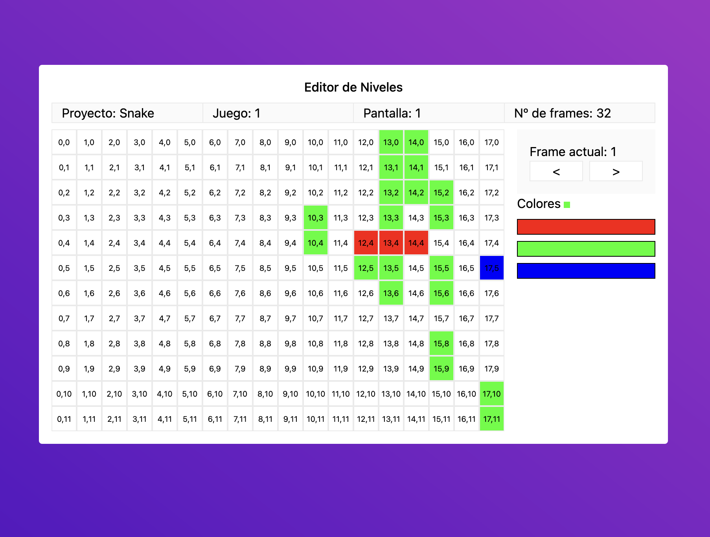

# Level Editor



### Prerequisitos

- Yarn ([descargar aquí](https://classic.yarnpkg.com/lang/en/docs/install/))

### Instrucciones

1. #### Situate en el directorio de la app, desde tu terminal:
```sh
cd lugar/donde/has/descargado/el/repositorio
```

2. #### Instala las librerias requeridas por la app ejecutando el siguiente comando desde tu terminal:
```sh
yarn install
```

3. #### Lanza la app (modo desarrollo) ejecutando el siguiente comando desde tu terminal:
```sh
vite dev
```

4. #### Profit

Introduce la URL que te aparecerá en la consola desde tu navegador preferido para acceder a la aplicación.
